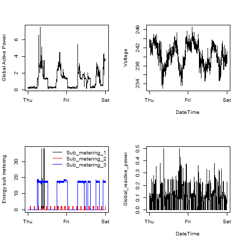

## The Data

The results from this exercise uses data from
the <a href="http://archive.ics.uci.edu/ml/">UC Irvine Machine
Learning Repository</a>

* <b>Dataset</b>: <a href="https://d396qusza40orc.cloudfront.net/exdata%2Fdata%2Fhousehold_power_consumption.zip">Electric power consumption</a> [20Mb]

## Transformation

Only data for February 1st and 2nd of 2007 were kept for the exercise.
A new POSXIlt variable was created that combined the Date and Time variable.  The new variable is called DateTime.

## The results of the four R scripts

Results were directly exported in PNG devices, with size of 480x480 pixels.
Results are shown below:

### Plot 1

 

### Plot 2

 

### Plot 3

 

### Plot 4

 

